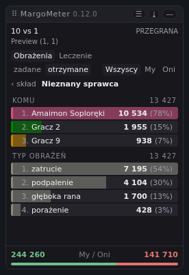

**Polski** · [English](README.en.md)

# MargoMeter

Miernik obrażeń do [Margonem](https://www.margonem.pl/) — statystyki walki na żywo, w panelu nad
grą. SKADA albo Details!, dla Margonem.

<table>
<tr>
<td valign="top" align="center">

 <b>Ranking</b>
  

 <b>Trzeci poziom</b>
  

 <b>Półka walk</b>
</td>
<td valign="top" align="center">

 <b>Rozwinięty wiersz</b>
  

 <b>Nieznany sprawca</b>
</td>
</tr>
<tr>
<td colspan="2" align="center">

 <b>Karta postaci</b>
</td>
</tr>
</table>

Walka dziesięciu na jednego, na zakładce obrażeń otrzymanych.

- Obrażenia i przywracanie życia, zadane i otrzymane, dla każdej postaci, w każdej walce.
- Wiersz się rozwija, i to trzy poziomy w głąb: kto komu, potem czym — umiejętnością albo typem
  obrażeń.
- Najedź na wiersz postaci — na liście albo w rozwiniętym wierszu — żeby zobaczyć jej kartę:
  wszystkie cztery liczby, krytyki, największy cios, co zatrzymała obrona i co zniszczył atak. To
  samo na każdej zakładce.
- Skończone walki trafiają na półkę i można do nich wrócić. Panel mówi, gdzie się toczyły.
- Tylko sumy, bez przeliczników. To, czego log nikomu nie przypisuje, dostaje własny wiersz i własną
  liczbę — nigdy nie doklejamy tego do czyjegoś wyniku. Ten wiersz mówi, czego gra nie podała, i też
  się rozwija: widać w nim, kogo to dosięgło i czym poszło.
- Tylko odczyt: żadnej sieci, żadnej automatyzacji, żadnego wpływu na przebieg walki.

## Instalacja

Otwórz [najnowsze wydanie][latest] i kliknij `margometer.user.js` — Tampermonkey rozpozna plik,
zainstaluje go i będzie aktualizował.

Działa w każdej aktualnej przeglądarce na komputerze: Chrome, Edge, Firefox i Safari. W Chrome i w
Edge trzeba jeszcze włączyć obsługę skryptów użytkownika na stronie rozszerzenia, w
`chrome://extensions` — bez tego nic się nie uruchomi i nic o tym nie powie.

[latest]: https://github.com/KamilGrocholski/margometer/releases/latest

## Zobacz na żywo

**[kamilgrocholski.github.io/margometer][preview]** odtwarza nagraną walkę w Twojej przeglądarce,
rysowaną przez plik z najnowszego wydania. Nic tam nie łączy się z grą.

[preview]: https://kamilgrocholski.github.io/margometer/
