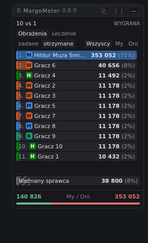
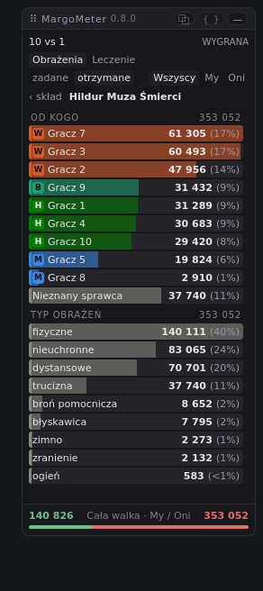
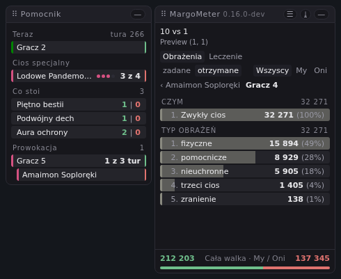
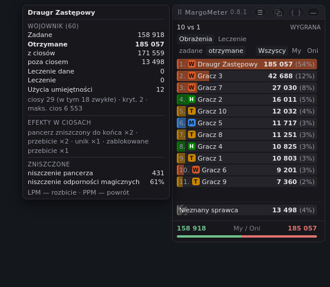

**Polski** · [English](README.en.md)

# MargoMeter

Miernik obrażeń do [Margonem](https://www.margonem.pl/) — statystyki walki na
żywo, w panelu nad grą. SKADA albo Details!, dla Margonem.

- Obrażenia i leczenie, zadane i otrzymane, dla każdego walczącego, w każdej
  walce.
- Każdy wiersz się rozwija: po przeciwniku, dalej po umiejętności i po rodzaju
  obrażeń.
- Najedź na wiersz, żeby zobaczyć kartę z całej walki — ile zatrzymała obrona i
  co zniszczył atak.
- Tylko sumy, bez przeliczników. To, czego log nikomu nie przypisuje, dostaje
  własny wiersz.
- Tylko odczyt: żadnej sieci, żadnej automatyzacji, żadnego wpływu na przebieg
  walki.

## Instalacja

Otwórz [najnowsze wydanie][latest] i kliknij `margometer.user.js` — Tampermonkey
rozpozna plik, zainstaluje go i będzie aktualizował.

Działa w każdej aktualnej przeglądarce na komputerze: Chrome, Edge, Firefox i
Safari. W Chrome i w Edge trzeba jeszcze włączyć obsługę skryptów użytkownika na
stronie rozszerzenia, w `chrome://extensions` — bez tego nic się nie uruchomi i
nic o tym nie powie.

[latest]: https://github.com/KamilGrocholski/margometer/releases/latest

## Zobacz na żywo

**[kamilgrocholski.github.io/margometer][preview]** odtwarza nagraną walkę w
Twojej przeglądarce, rysowaną przez plik z najnowszego wydania. Nic tam nie
łączy się z grą.

[preview]: https://kamilgrocholski.github.io/margometer/

## Zrzuty ekranu

Obrażenia otrzymane w walce dziesięciu na jednego.

| | |
|---|---|
|  |  |
|  |  |
