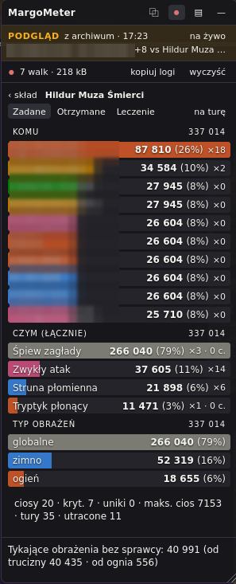
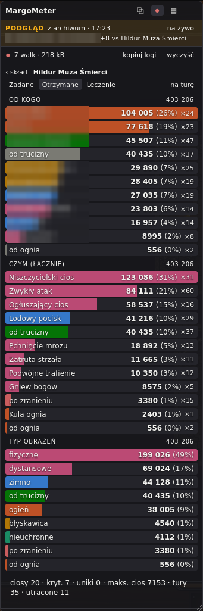

# MargoMeter

Licznik obrażeń do [Margonem](https://www.margonem.pl/) — statystyki z okna
walki, na żywo, w okienku nad grą. To, czym dla World of Warcraft są SKADA
i Details!, tyle że Margonem jest turowy, więc i licznik liczy na tury.

Dodatek **niczego nie wysyła i nie dotyka gry** — czyta to samo okno walki, co
Ty, i rysuje obok własny panel.

---

## Jak zainstalować

**1. Zainstaluj [Tampermonkey](https://www.tampermonkey.net/)** — rozszerzenie do
przeglądarki, które uruchamia dodatki użytkownika. Na stronie są wersje na
Chrome, Firefoksa, Edge i resztę.

**2. Zbuduj plik dodatku.** Potrzebny [Bun](https://bun.sh/):

```bash
bun install
bun run build
```

Powstanie `dist/margometer.user.js`.

> Tego pliku nie ma w repozytorium — `dist/` jest w `.gitignore`, więc build
> trzeba odpalić u siebie.

**3. Wgraj skrypt do Tampermonkey.** Ikona rozszerzenia → **Utwórz nowy skrypt**,
wyczyść okienko, wklej **całą** zawartość `dist/margometer.user.js` i zapisz
(Ctrl+S).

**4. Wejdź do gry i zacznij walkę.** Panel pojawi się sam. Nic nie trzeba
włączać — dodatek startuje na światach `*.margonem.pl` i `*.margonem.com`,
a poza walką po prostu nic nie rysuje.

---

## Co to jest

Panel pokazuje, **kto ile zrobił** — w bieżącej walce, na bieżąco.

**Trzy zakładki:** `Zadane` · `Otrzymane` · `Leczenie`. W danej chwili ranking
pokazuje jedną z nich; reszta jest o jedno kliknięcie.

**Trzy filtry składu:** `Wszyscy` · `My` · `Oni`.

**Wchodzenie w szczegóły to jeden gest.** Lewy przycisk wchodzi, prawy wychodzi
— na każdym szczeblu ten sam:

- klik w postać z rankingu → **komu** zadała (albo **od kogo** dostała);
- klik w cel → **czym** w niego poszło;
- osobna sekcja **CZYM (ŁĄCZNIE)** sumuje umiejętności po wszystkich celach,
  a klik w umiejętność pokazuje, komu zadała — ten sam gest z drugiej strony.

**Najechanie pokazuje szczegół, zanim klikniesz** — udział procentowy, średnią
na turę, liczbę ciosów. Jest też przełącznik `na turę` dla całej listy.

**Panel mówi też, czego NIE wie.** W stopce stoją przypisy o liczbach, których
log nie przypisuje nikomu — bo np. przy dziesięciu graczach na jednego bossa
nie da się wskazać, kto zatruł. Licznik woli to powiedzieć, niż zgadnąć.

Dodatkowo: nagrywanie walk do pamięci przeglądarki wraz z archiwum
i odtwarzaniem, kopiowanie statystyk do schowka, kolory profesji i rozbicie
obrażeń na rodzaje. Okno przeciąga się i zwija, a jego położenie przeżywa F5.

---

## Zrzuty ekranu

Obie ilustracje pochodzą z tej samej walki: **dziesięciu graczy przeciwko
bossowi Hildur Muza Śmierci** z najnowszego eventu wakacyjnego. Na obu wszedłem
w samego bossa, więc widać jego stronę starcia.

> ⚠️ Zrzuty są sprzed poprawek z 1 sierpnia 2026 i **nie pokazują już panelu
> takim, jaki jest**: rodzaje obrażeń zwinęły się w rodziny (dziewięć wierszy →
> siedem), pozycje bez sprawcy zeszły do jednego wiersza na końcu rankingu,
> a paski są jaśniejsze, żeby tekst na nich przechodził próg czytelności.
> Do wymiany.

**Zadane — co boss zadał i czym**

Ranking `KOMU` mówi, kogo bił, `CZYM (ŁĄCZNIE)` — którą umiejętnością, po
wszystkich celach naraz. Na dole przypis o obrażeniach, których log nie
przypisuje nikomu: przy dziesięciu graczach nie da się wskazać, kto zatruł.



**Otrzymane — od kogo boss oberwał**

Ta sama walka z drugiej strony: `OD KOGO` to ranking bijących w niego,
a `TYP OBRAŻEŃ` rozbija te 403 206 na rodzaje. Ranking wymienia same postacie —
to, czego log nie przypisał nikomu, zbiera się pod nim w jednym wierszu
`Bez sprawcy`, a klik w niego mówi, co w tej puli siedzi.



---

## Dla programistów

```bash
bun install
bun run check     # typecheck + testy + build
bun test          # same testy
```

Dlaczego kod wygląda, jak wygląda, i czego log o walce nie mówi — w katalogu
[`ai/`](ai/). Zaczynaj od [`ai/README.md`](ai/README.md): mówi, co gdzie siedzi,
jakie zasady obowiązują w tym repo i jak wyglądały poprzednie rundy pracy —
reszta katalogu jest do czytania wybiórczo, nie od deski do deski.

Zrzuty walk, na których stoją testy, siedzą w `tests/fixtures/new-engine/`;
przy każdym stoi `meta.json` z opisem, co ten fixture pokrywa.
