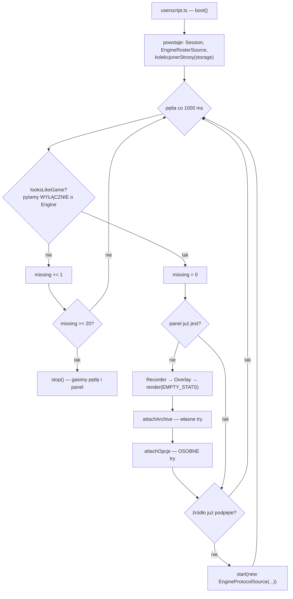
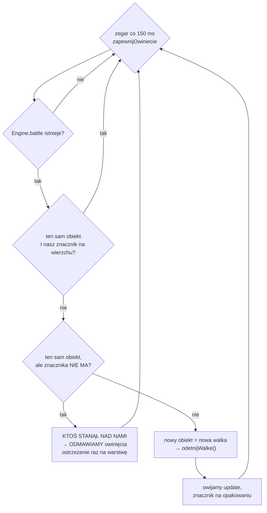
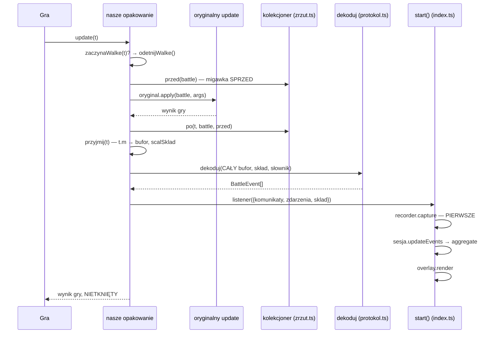
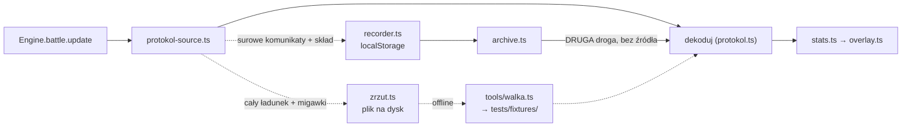

# Potok — jak dane idą od gry do panelu

Cała droga w jednym miejscu: jak dodatek trafia na stronę, jak się inicjalizuje,
jak podpina się do gry, co dzieje się z jedną porcją danych i co robią tory
boczne. Ten plik jest **kanoniczny dla szczegółów** — trzy krótsze diagramy
(`AGENTS.md`, `docs/README.md`, `SOLID.md §1`) zostają jako skróty i odsyłają
tutaj.

**Czego tu NIE MA i to jest zasada, nie przeoczenie:**

- **numerów linii** — wskazanie „nazwa pliku plus numer" starzeje się
  bezgłośnie, a wygląda przy tym na precyzję. `SOLID.md` niesie
  ich osiemdziesiąt kilka i większość nie prowadzi tam, gdzie mówi; ostrzeżenie
  o tym w `AUDYT.md` **zestarzało się samo** (`AUDYT‑46`: `overlay.ts` miał
  2456 linii przy zdaniu „trzeba go ciąć", potem 2628, potem 3181). Tu stoją
  **nazwy funkcji i eksportów** — te da się znaleźć `grep`em i przeżywają
  przenoszenie kodu;
- **liczb bieżących** — ile testów, ile kluczy, ile linii. `bun test` mówi prawdę
  w kilka sekund i nie ma sensu trzymać jej kopii;
- ⚠️ **wyjątek:** cytaty ze ŹRÓDEŁ GRY (`Battle.js`, `BattleMessages.js`)
  zostają z numerami linii. Wskazują na zamrożony build deweloperski, więc nie
  mają jak się przesunąć — i to one są dowodem, a nie odsyłaczem.

Pilnują tego dwa testy w `tests/potok.test.ts`: każdy moduł `src/` musi tu być
wymieniony (i odwrotnie — każda wymieniona nazwa musi istnieć), a numery linii
naszych plików są zakazane. **Reguła bez strażnika jest regułą o kodzie, nie
o repozytorium** — repo zapisało tę lekcję cztery razy.

---

## 1. Potok na jednym ekranie

```
Engine.battle.update  →  protokol-source.ts → komunikaty `t.m` + skład
                      →  protokol.ts        → BattleEvent[]  (rozbiór klucz po kluczu)
                      →  slownik-gry.ts     → brzmienia efektów z `window._t`
                      →  stats.ts           → BattleStats  (agregacja, rozbicia, instancje)
                      →  session.ts         → pamięta ostatni odczyt
                      →  overlay.ts         → panel w Shadow DOM
```

Trzy rzeczy, których ten skrót nie pokazuje, a które są w potoku najważniejsze:

1. **`BattleEvent[]` (`types.ts`) jest KONTRAKTEM**, nie szczegółem. Przeżył
   wymianę całego odczytu w sierpniu 2026 i to on dzieli potok na „przed" i „po".
   ⚠️ Ale **przeżył ją z bagażem** (`AUDYT‑119`, 2026‑08‑09): wariant
   `fight-start`, którego dekoder nie produkuje ani razu, wraz z martwym trybem
   `stats.ts` wiszącym na nim, dotrwał tu pięć dni na własnym korpusie testowym.
   Granica jest dobra; jej ZAWARTOŚĆ starzeje się razem ze skasowanym wejściem.
2. **Strzałki się rozgałęziają.** Po `stats.ts` idą trzy niezależne drogi:
   panel, nagrywarka i archiwum.
3. **`dekoduj` ma dwóch konsumentów produkcyjnych**, nie jednego — `archive.ts`
   woła go wprost, z pominięciem źródła. To jest cały powód, dla którego dekoder
   jest osobnym, czystym modułem.

---

## 2. Skąd bierze się dodatek

`build.ts` składa **jeden plik IIFE**, bo Tampermonkey nie ładuje modułów ES.
Wejściem bundlera jest `userscript.ts` — jedyny plik w `src/` z efektem
ubocznym, i dlatego osobny: import czegokolwiek innego w teście nie podnosi
panelu ani nie zostawia działającego interwału.

Wychodzą **dwa** artefakty:

| plik | co to |
|---|---|
| `margometer.user.js` | nagłówek + bundle — to instaluje gracz |
| `margometer.meta.js` | **sam nagłówek** — to pobiera Tampermonkey, sprawdzając `@updateURL`; bez tego każde sprawdzenie wersji ściągałoby cały skrypt po jedną linię |

Nagłówek składa `banner` z `tools/userscript-meta.ts` — osobny moduł od
`build.ts`, bo `build.ts` ma efekty uboczne i nie da się go zaimportować
w teście bez zbudowania wszystkiego. A test jest tu potrzebny: **błąd w `@match`
trafił użytkowników już dwa razy.** Nazwy plików idą z `tools/artifacts.ts`,
numer wersji z `package.json`.

Co w nagłówku jest decyzją:

- **`@match` kończy się na `/*`, nie na `/`** — wzorzec porównuje ścieżkę razem
  z query stringiem, więc `https://*.margonem.pl/` nie łapie adresu z jakimkolwiek
  `?…`;
- **dziesięć `@exclude`** — po pięć na domenę (goła, `www`, `forum`, `commons`,
  `pomoc`). Symetria jest wymuszona, nie kosmetyczna: asymetria była usterką;
- **`@grant none`** — dodatek nie używa API Tampermonkey. Siedzi w kontekście
  strony, bo musi widzieć `window.Engine`;
- **`@run-at document-idle`** i **`@noframes`**.

Podgląd `dist/preview.html` udaje **silnik**, nie DOM: seed stawia
`window.Engine = { battle: { warriors, myteam, update } }` i po dwóch sekundach
puszcza komunikaty. Dwie sekundy, bo pętla startowa tyka co jedną — jedno
tyknięcie musi zdążyć owinąć `update`. Zysk poza poprawnością: **podgląd idzie
dokładnie tą samą drogą co gra**, razem z owijaniem i z wyścigiem o podpięcie.

---

## 3. Inicjalizacja



Kolejność nie jest dowolna i każdy krok ma powód:

- **kolekcjoner zrzutów powstaje PRZED panelem i przed źródłem**, bo czyta własną
  flagę z magazynu i musi być gotowy na pierwszą walkę — także tę, która zacznie
  się, zanim gracz otworzy ustawienia;
- **panel rysuje się przed archiwum i opcjami** — licznik jest produktem,
  archiwum dodatkiem, i to dodatek ma paść pierwszy, jeśli coś pójdzie źle;
- **archiwum i opcje mają OSOBNE `try`**, nie wspólne. We wspólnym bloku
  rozsypane archiwum zabierałoby ustawienia, choć nie mają ze sobą nic wspólnego;
- **`looksLikeGame` pyta wyłącznie o `Engine`.** Drugi warunek — okno walki
  w DOM — zszedł razem z odczytem ze zdań: strona z oknem walki, ale bez
  `Engine`, nie dałaby nam nic do przeczytania, więc warunek obiecywałby grę
  tam, gdzie dodatek i tak stanąłby pusty;
- **poddajemy się po dwudziestu kolejnych pudłach.** `@match` obejmuje całą
  domenę, więc dodatek startuje też na podstronach, które grą nie są. Licznik
  jest **kolejnych** porażek, nie sumarycznych — raz postawiony panel nie znika
  przy jednym pudle;
- **`localStorage` jest opcjonalny.** `safeStorage` próbuje jednego odczytu
  w `try` (dostęp rzuca przy zablokowanych ciasteczkach) i przy porażce oddaje
  `undefined`. Cały dodatek działa wtedy bez pamięci.

---

## 4. Podpięcie do gry — jedyne miejsce, które jej dotyka

Protokół **istnieje wyłącznie w argumencie wywołania** i nigdzie nie osiada:
`Engine.battle` po powrocie z `update` niesie STAN (wojownicy, życie, tura),
nie zdarzenia. Odpytywanie — czyli to, co robi `roster.ts` — daje krzywą życia
i nic więcej. Dlatego `protokol-source.ts` **owija `Engine.battle.update`**,
i dlatego jest osobnym plikiem: ma być widoczny w drzewie, a nie schowany
w środku modułu.

⚠️ **Tu pękła obietnica „nie dotykamy stanu gry".** Owinięcie cudzej funkcji
jest dotknięciem, choćby nic nie zmieniało. Cztery gwarancje, które zostają,
i każda ma test oraz sprawdzoną mutację:

| gwarancja | czym zabezpieczona |
|---|---|
| oryginał leci pierwszy | `oryginal.apply` przed naszym odczytem |
| jego wynik wraca nietknięty | zwracamy dokładnie to, co oddał |
| nasz wyjątek nie wychodzi do gry | osobne `try` wokół każdego naszego kroku |
| zdejmujemy WYŁĄCZNIE swoją warstwę | znacznik z wersją na opakowaniu |



Dwie rzeczy warte zapamiętania:

- **zegar pilnuje TOŻSAMOŚCI obiektu, nie obecności funkcji.** Gra potrafi
  wymienić obiekt walki, więc „update jest już owinięty" trzeba pytać o TEN
  obiekt, nie w ogóle;
- **odmowa przy cudzej warstwie** (`AUDYT‑107`) — owinięcie drugi raz wkładało
  nasze opakowanie do łańcucha dwukrotnie i **podwajało liczby całkowicie
  cicho**, bo każdy komunikat z osobna był poprawny. Zakładamy, że nasza warstwa
  siedzi pod cudzą; jeśli ktoś nas PODMIENIŁ, zamilkniemy — ale zamilknięcie
  ma czujkę (pusty odczyt), a podwojenie nie miało żadnej.

⚠️ **Podpięcie jest wyścigiem i zostaje wyścigiem.** Między startem walki
a naszym tikiem jest okno, w którym `update` leci nieowinięte — a jedna
przegapiona porcja potrafi być całą walką, bo protokół przysyła je hurtem.
Wyścigu nie zamyka zegar; zamyka go dopiero to, że pusty odczyt na koniec walki
mówi graczowi wprost „nie zdążyliśmy się podpiąć" (`stan-odczytu.ts`).

---

## 5. Jedna porcja danych



**Granicą walki jest `data.init`, a nie wymiana obiektu.** Gra tworzy
`Engine.battle` raz i używa go dalej, zmieniając stan, nie referencję — więc
warunek „nowy obiekt" jest wystarczający, ale nie konieczny. Dopóki stał sam,
druga walka w sesji doliczała się do pierwszej. Predykat `zaczynaWalke` mieszka
w `zrzut.ts`, bo woła go **i dodatek, i narzędzie offline** — dwie definicje
granicy rozjechałyby się cicho.

⚠️ **To jest dziś JEDYNA granica.** `session.ts` miał być drugą warstwą i nie
był: dzielił po zdarzeniu, którego dekoder nie produkuje (`AUDYT‑108`). Martwe
kryterium zeszło z drzewa; podział po `fight-end` jako drugi świadek jest wciąż
otwarty.

Dwie decyzje o buforze:

- **bufor NARASTA, a dekodujemy CAŁĄ walkę od nowa przy każdej porcji.** Stan
  przyrostowy byłby źródłem podwójnego liczenia, a walka ma kilkadziesiąt
  komunikatów, więc koszt jest bez znaczenia. Zysk dodatkowy: `dekoduj` zostaje
  funkcją czystą;
- **skład DOKŁADA się (`scalSklad`), zamiast zastępować.** Migawka bywa pusta
  („gra akurat nie wystawia stanu"), a dekoder zamienia `id` na nazwę wyłącznie
  po tej liście — więc skład, który na chwilę zniknie, zabrałby ze sobą także
  to, co odczytano wcześniej.

**Pięć osłon wyjątkowych ma rozmyślnie różny zasięg**, i to nie jest ostrożność
wobec własnego kodu — ten callback leci ze środka `Engine.battle.update`, więc
wyjątek stąd przewraca graczowi TURĘ, a nie panel:

- migawka „przed" ma **własną** osłonę, bo jest jedynym naszym kodem przed
  oryginałem;
- `kolekcjoner.po` NIE dzieli `try` z odczytem — narzędzie deweloperskie nie ma
  prawa zatrzymać licznika, który jest produktem;
- zerowanie flagi świeżej walki siedzi w `finally`, bo awaria gry nie może
  zostawić jej podniesionej na zawsze;
- **nagrywanie idzie PIERWSZE** (`index.ts`): gdyby dekoder się wysypał,
  zabrałby ze sobą surowy materiał, którym dałoby się tę awarię odtworzyć.
  Nagranie ma przeżyć licznik, nie odwrotnie.

---

## 6. Dekodowanie — `protokol.ts`

Plik **nie dotyka gry**: zero globali, zero DOM, zero `try/catch`. Wejściem są
stringi, wyjściem `BattleEvent[]`. Trzy warstwy, zależność tylko w dół:

```
komunikat: string
   │  1 — rozbierz(): składnia, ZERO semantyki
   ▼
Komunikat { nadawca, cel, parametry[] }
   │  2 — rola(): tabela kluczy (DANE, nie kod)
   ▼
Rola per parametr
   │  3 — dekoduj(): redukcja parametrów do zdarzeń
   ▼
BattleEvent[]
```

Jedna linia protokołu wygląda tak: `id[=hpp];id[=hpp];klucz[=wartość];…;flaga`.
Dwa pierwsze segmenty to strony, reszta to parametry. Rozbiór **odwzorowuje
`battleMsg` z `BattleMessages.js` linia w linię** — `parseInt` a nie `Number`,
`indexOf("=") > 0` a nie `!== -1`, `id === 0` jako BRAK strony — bo to jedyna
istniejąca implementacja tego formatu i lepiej ją odwzorować niż wymyślić własną
interpretację obok.

**Rozbiór nie ma trybu porażki.** Każdy string daje `Komunikat`, choćby pusty —
gra też go nie ma. Porażka ma być widoczna piętro wyżej, na nierozpoznanym
kluczu, czyli tam, gdzie da się powiedzieć, CZEGO nie rozumiemy.

**Brzmienia efektów idą z GRY, nie z naszego kodu.** `slownik-gry.ts` woła
globalne `window._t` — tę samą funkcję, którą renderer walki składa swoje
zdania — więc panel pokazuje `+Przebicie`, a nie klucz `+pierce`, i robi to
w języku klienta. Gdy słownika nie ma albo gra nie zna identyfikatora, zostaje
KLUCZ: klucz jest prawdą, zdanie zmyślone przez nas nie byłoby. Zdanie
z niewypełnioną dziurą (`%name%`) też odpada — udaje brzmienie z gry, którym
nie jest.

**Czujka nieznanego ma dwie osie**, bo `unknown` znaczy cztery różne rzeczy
(`AUDYT‑114`):

| | odrzucone — strata | zachowane — zero straty |
|---|---|---|
| **cały komunikat** | `id` spoza składu, brak nazwy strony | niesparowane `-dmgX` (cios i tak powstaje) |
| **jeden segment** | nieznany klucz i dziesięć dalszych powodów | obcięcie na drugim `=` (klucz i tak przetworzony) |

Dlatego zdarzenie niesie `scope` i `dropped`, a dekoder ma **trzy nazwane
wejścia** czujki (`odrzucKomunikat`, `odrzucSegment`, `zastrzezenie`) zamiast
jednej funkcji przyjmującej raz komunikat, raz segment. Miejsce wywołania musi
dać się przeczytać bez wchodzenia do definicji.

⚠️ **To jest najmniej pewna warstwa dodatku.** Rozbiór odwzorowuje źródło gry,
tabela ról ma przy każdym wpisie cytat, klucze mają świadka w assecie — ale
SKŁADANIE ich w `BattleEvent` nie ma świadka nigdzie. Częściowego dostarcza
`tests/fixtury.ts`: protokół podaje procent życia celu, migawka wojownika niesie
`hp.max`, te dwie liczby idą z różnych miejsc i nikt ich u nas nie uzgadnia —
więc skumulowane obrażenia muszą trafić w podany procent.

---

## 7. Agregacja — `stats.ts`

`aggregate(events, roster)` → `BattleStats`. Funkcja czysta, bez DOM i bez czasu.
Co powstaje:

- **wiersze postaci** — obrażenia zadane i przyjęte, leczenie, trafienia, kryty,
  bloki, pochłonięcia;
- **rozbicia** — kto komu zadał, czym padło, jakie efekty; niezmiennik: sumy
  rozbić muszą się zgadzać ze skalarami;
- **instancje** — dwa potwory o tej samej nazwie rozdziela `id` ze składu, a gdy
  go nie ma, wnioskowanie ze spadku życia. Wiersz niepewny dostaje w panelu
  gwiazdkę; nazwa goła znaczy „log nie rozdzielił", nazwa z numerem — „to my
  rozdzieliliśmy";
- **oś tur** — turą jest jedna AKCJA (cios, umiejętność, krok), tak jak liczy je
  gra;
- **pule bez sprawcy** — trucizna i leczenie, o których log nie mówi, kto je
  wywołał. **Nie zgadujemy**: wolno pokazać „nie wiadomo", nie wolno zmyślić
  nazwiska.

`roster.ts` dostarcza skład **odpytywaniem** `Engine.battle` (a nie owinięciem)
i na każdą wątpliwość zwraca `null` — tu taka postawa jest właściwa, bo pusty
skład jest mniej szkodliwy niż zmyślony.

---

## 8. Panel — `session.ts` + `overlay.ts`

`Session` trzyma **jedno pole**: statystyki ostatniego bufora. Nie pamięta ani
zdarzeń, ani składu, ani rundy — przelicza wszystko od nowa. Nazwa jest dziś
szersza od roboty: nie sumuje sesji i nie wybiera walki.

`stan-odczytu.ts` odpowiada na dwa pytania, na które panel musi umieć
odpowiedzieć: czy walka się skończyła i czy odczyt jest PUSTY. Puste wiersze nie
świadczą o treści — `aggregate` buduje je ze SKŁADU, więc sesja, która nie
zobaczyła ani jednego ciosu, ma komplet postaci i same zera. Pusty odczyt na
koniec walki znaczy „nie zdążyliśmy się podpiąć" i gracz ma to usłyszeć wprost,
zamiast patrzeć na panel, który wygląda na działający.

`overlay.ts` rysuje w **Shadow DOM**, a `:host` ma `all: initial` — bez tego gra
przemalowałaby panel swoim globalnym CSS-em. Arkusz obu okien jest jeden
(`style.ts`), bo „stylu archiwum" nie ma: reguły panelu obowiązują tam tak samo.

Trzy rzeczy w renderowaniu są decyzją:

- **panel NIE przebudowuje się od zera.** Szkielet — panel, korpus, okruszek,
  nagłówek, uchwyty — powstaje raz i żyje. Świeży węzeł nie jest pod kursorem,
  dopóki mysz się nie ruszy, więc przebudowa gasiła podświetlenie kilka razy na
  sekundę dokładnie na elemencie, który ma dawać znać, że kontekst się trzyma;
- **zdarzenia idą przez delegację na shadow root**, nie przez listenery na
  wierszach — te nie odpaliłyby się dla świeżego węzła pod nieruchomym kursorem;
- **drążenie działa na `pointerup`, nie na `click`.** Podczas odtwarzania panel
  przebudowuje się co klatkę, więc wiersz spod kursora znika MIĘDZY `pointerdown`
  a `pointerup` — a wtedy przeglądarka albo nie wystawia `click` wcale, albo
  wystawia go na trwałym korpusie. Tożsamością jest **nazwa z wiersza, nie
  węzeł**, z prefiksem listy, żeby ta sama nazwa w dwóch listach nie domknęła
  gestu na krzyż.

LPM wchodzi o szczebel głębiej, PPM wraca o jeden. `preventDefault` na PPM leci
tylko wtedy, gdy kursor jest nad panelem I jest gdzie wracać — archiwum ma własne
pole tekstowe i jest jedynym miejscem, gdzie natywne menu jest naprawdę
potrzebne.

Moduły pomocnicze panelu: `window.ts` (przeciąganie, przycinanie do widoku —
okno zsunięte nad górną krawędź byłoby nie do odzyskania, bo uchwytem jest tylko
nagłówek), `stored-state.ts` (jedyne miejsce, które nie ufa zapisom w magazynie:
`{"width": 1e9}` dałoby nakładkę przykrywającą całą grę), `confirm.ts` (dwuklikowe
potwierdzenie z wygasaniem, jedna implementacja dla trzech miejsc),
`palette.ts` (barwy klas i typów obrażeń), `version.ts` (numer w nagłówku, bo
zgłoszenia przychodzą zrzutem ekranu równie często jak JSON-em), `opcje.ts`
(okno ustawień z trybem deweloperskim).

---

## 9. Trzy tory boczne



**`recorder.ts` — nagrywarka.** Zapisuje SUROWE komunikaty i skład, nigdy
policzonych statystyk, żeby stare nagranie dało się przeliczyć nowszym
dekoderem. Nagrywanie przeżywa odświeżenie gry (własna flaga), bo inaczej każde
F5 gasiłoby je po cichu. Ma budżet znaków i eksmituje najstarsze nagrania.

**`archive.ts` — odtwarzanie.** To ono jest **drugim konsumentem `dekoduj`**
i woła go wprost, z pominięciem `EventSource`. Odtwarzanie klatka po klatce to
po prostu dekodowanie coraz dłuższego prefiksu komunikatów. Skład idzie do
agregatu razem z nimi — bez niego wszyscy aktorzy mieliby `side: null`, więc
filtr „nasi / obcy" nie miałby czego filtrować.

**`zrzut.ts` — materiał dowodowy.** Zbiera CAŁY ładunek każdego wywołania plus
migawki wojowników przed i po, i zapisuje to plikiem na dysk (nie do magazynu,
nie do schowka). **Zapisuje, nie interpretuje** — interpretacja jest zadaniem
narzędzia offline. Wpina się w owinięcie, które już stoi, i to jest cały powód
jego istnienia: sonda konsolowa zakłada DRUGĄ warstwę na tej samej funkcji,
a dwie warstwy znoszą sens czterech gwarancji z sekcji 4.

Droga materiału do repo prowadzi przez `tools/walka.ts` (`--zachowaj`), który po
drodze **podstawia pseudonimy graczy** etykietami `Gracz N` i **zdejmuje opisy
umiejętności** — brzmienia i pseudonimy nie mają prawa leżeć w publicznym
repozytorium. Pilnują tego niezmienniki w `tests/fixtury.test.ts`.

---

## 10. Gdzie mieszka stan

| co pamięta | gdzie |
|---|---|
| bufor komunikatów TEJ walki, skład narastająco, tożsamość owiniętego obiektu | `protokol-source.ts` |
| nic między wywołaniami — funkcja czysta | `protokol.ts`, `stats.ts` |
| statystyki ostatniego bufora (jedno pole) | `session.ts` |
| indeks nagrań, bieżące nagranie, flaga nagrywania | `recorder.ts` |
| własna kopia komunikatów odtwarzanego nagrania + kursor klatki | `archive.ts` |
| bufor wywołań i numer walki | `zrzut.ts` |
| co jest pokazane, drążenie, geometria | `overlay.ts` |

Klucze w `localStorage` — wszystkie z prefiksem `margometer.`:

| klucz | co trzyma |
|---|---|
| `margometer.panel` | pozycja, rozmiar, zwinięcie, wybrana metryka i drużyna, „na turę" |
| `margometer.archive` | geometria i stan okna archiwum |
| `margometer.opcje` | geometria i stan okna ustawień |
| `margometer.rec.index` | indeks nagrań (wersja formatu, następne `id`, lista) |
| `margometer.rec.<id>` | jedno nagranie: komunikaty + skład, jako JSON |
| `margometer.rec.on` | flaga „nagrywam" — przeżywa odświeżenie gry |
| `margometer.dev` | flaga trybu deweloperskiego, świadomie OSOBNA od stanu panelu: zbieranie musi ruszyć przed pierwszą walką, czyli zanim ktokolwiek narysuje panel |
| `margometer.probe` | **nigdy nie zapisywany** — sonda sprawdzająca, czy magazyn w ogóle da się dotknąć |

---

## 11. Czego potok NIE robi

- **Nic nie wychodzi na sieć.** Zero zapytań. Odczyt brzmień z `window._t` to
  wywołanie funkcji już obecnej na stronie, a nie pytanie do serwera — i pytamy
  wyłącznie o identyfikatory zaszyte w naszym kodzie.
- **Nie automatyzujemy niczego** i nie zmieniamy przebiegu walki: oryginał leci
  pierwszy, jego wynik wraca nietknięty.
- **Nie udajemy danych, których log nie ma.** Log nie mówi, kto nałożył
  truciznę ani kto leczył. Wolno pokazać „nie wiadomo"; nie wolno zgadnąć
  i pokazać nazwiska.
- ⚠️ **Nie mówimy już „nie dotykamy stanu gry".** Owinięcie cudzej funkcji jest
  dotknięciem, choćby nic nie zmieniało — i lepiej to napisać, niż bronić
  definicji słowa „dotyka". Co dodatek gwarantuje zamiast tego: tabela
  w sekcji 4.

---

## Dalej

- `AGENTS.md` — instrukcje projektu, skrót potoku w sekcji „Układ"
- [`README.md`](README.md) — indeks całego katalogu `docs/`
- [`DECYZJE.md`](DECYZJE.md) — czego log NIE mówi i co z tego wynika
- [`AUDYT.md`](AUDYT.md) — co w tym potoku jest dziś zepsute
- [`MECHANIKA.md`](MECHANIKA.md) — jak zachowuje się GRA i skąd to wiadomo
- [`specy/`](specy/) — jak rozumowaliśmy przy poszczególnych zmianach
